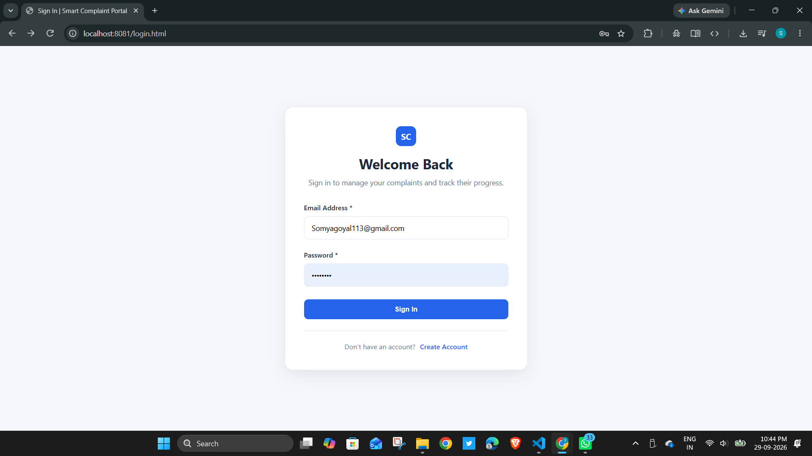
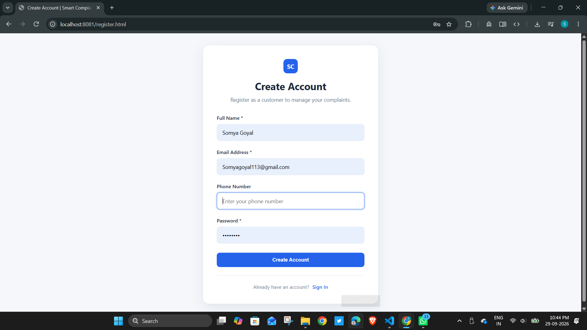
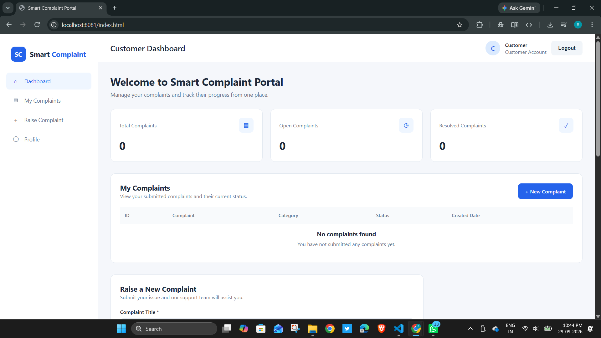
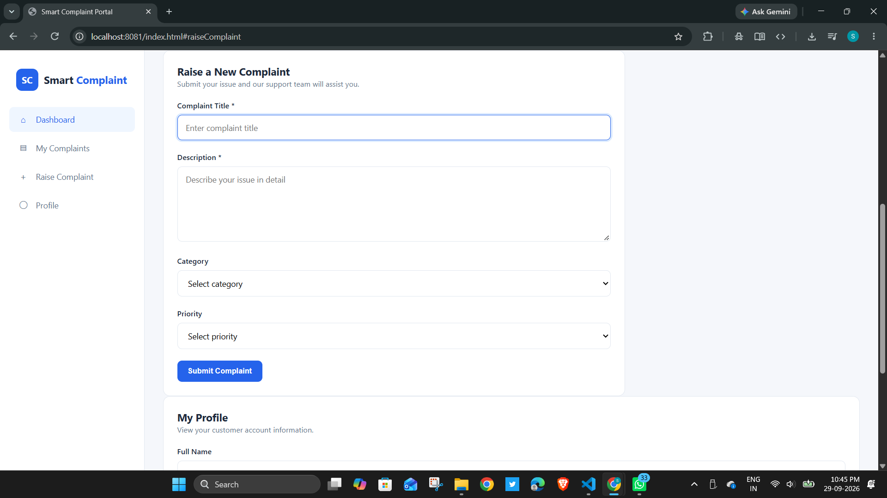
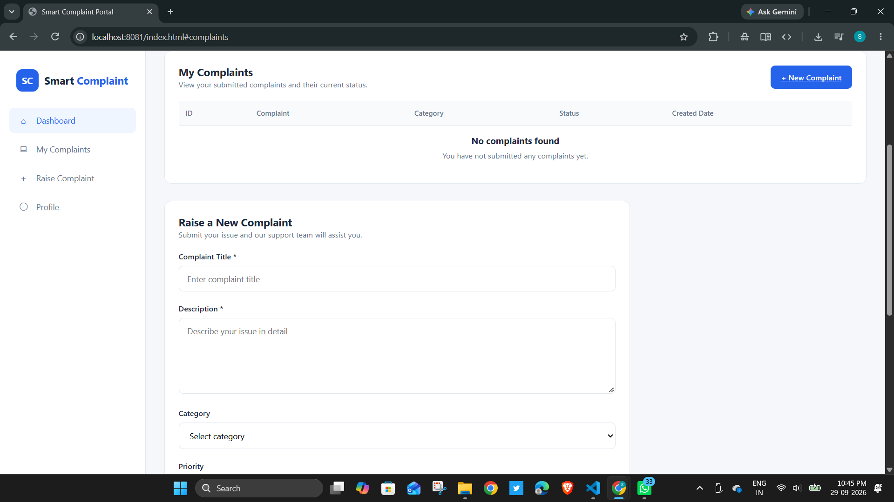
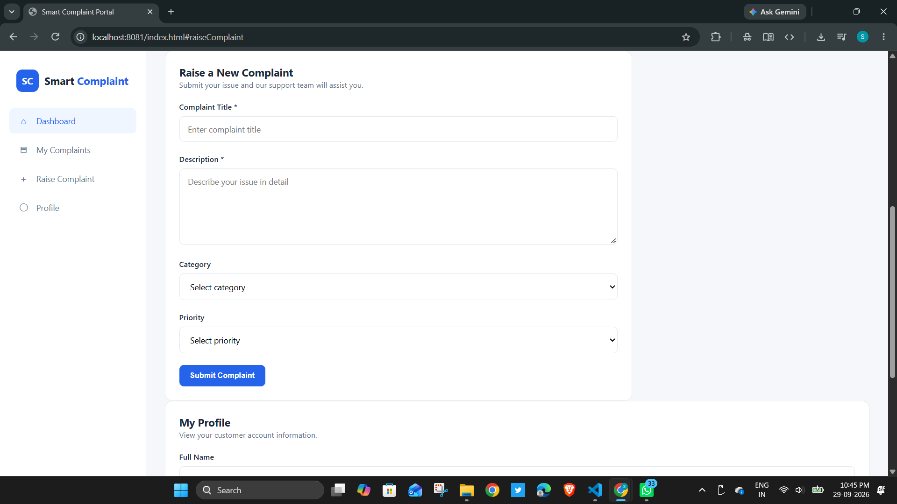
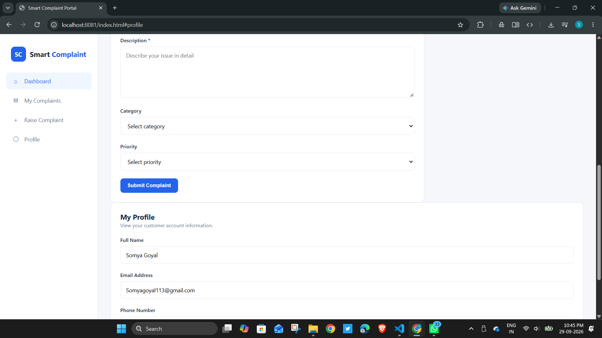

Smart Complaint & Service Management Portal

  
  
  
  
  
  
  
  

Smart Complaint & Service Management

From complaint registration to resolution.

A full-stack web application that connects customers, engineers and administrators
through a centralized complaint registration, assignment, tracking and resolution workflow.

💡 What is Smart Complaint & Service Management Portal?

Smart Complaint & Service Management Portal is a full-stack complaint and
service management application developed using Java and Spring Boot.

The system provides a centralized platform where customers can register and
track complaints, engineers can manage assigned complaints and update their
resolution status, and administrators can assign complaints and monitor
overall service activity.

The application implements a structured complaint lifecycle with
role-based access control, JWT-secured REST APIs, file attachments,
complaint conversations and administrative analytics.

✨ Key Features

Complaint Registration — Customers can raise complaints with title, description, category and priority.

Complaint Tracking — Customers can view their complaints and monitor their current status.

Engineer Assignment — Administrators can assign complaints to engineers.

Complaint Lifecycle — Complaints move through OPEN → IN_PROGRESS → RESOLVED → CLOSED.

Role-Based Access Control — Separate access and operations for Customers, Engineers and Admins.

JWT Authentication — Stateless authentication using JSON Web Tokens.

Secure Password Storage — Passwords are protected using BCrypt password hashing.

Complaint Conversations — Customers and engineers can communicate through complaint-specific comments.

File Attachments — Complaint-related files can be uploaded and downloaded through secured endpoints.

Admin Analytics — Administrators can view complaint statistics and service activity.

REST APIs — Application functionality is exposed through RESTful endpoints.

Swagger / OpenAPI — Interactive API documentation for exploring and testing endpoints.

Validation & Exception Handling — Request validation and centralized exception handling for API errors.

Unit Testing — Service-layer and application-context tests are included.

👥 User Roles

Role

Capabilities

Customer

Register, login, raise complaints, view own complaints, upload attachments, communicate with engineers, close or reopen eligible complaints

Engineer

View assigned complaints, start work, update complaint status, resolve complaints and communicate with customers

Admin

View complaints, assign engineers, manage complaint status and view analytics

🔄 Complaint Lifecycle

<pre>
                         CUSTOMER
                            │
                            ▼
                    Raise Complaint
                            │
                            ▼
                          OPEN
                            │
                    Engineer Starts Work
                            │
                            ▼
                       IN_PROGRESS
                            │
                    Engineer Resolves
                            │
                            ▼
                        RESOLVED
                            │
                    Customer Accepts
                            │
                            ▼
                         CLOSED
                            │
                     ┌──────┴──────┐
                     │             │
                  Reopen        Remain Closed
                     │
                     ▼
                 IN_PROGRESS
</pre>

The complaint state transitions are validated in the backend to prevent
invalid status changes.

🖼️ Screenshots

Login Page

  

Account Creation

  

Customer Dashboard

  

Raise Complaint

  

Complaint Section

  

Create Complaint

  

Profile

  

🏗️ Architecture Overview

<pre>
                         SMART COMPLAINT PORTAL
                                  │
                     ┌────────────┴────────────┐
                     │                         │
                     ▼                         ▼
                Frontend                  REST API Layer
             HTML / CSS / JS              Spring Boot
                     │                         │
                     │              ┌──────────┼──────────┐
                     │              ▼          ▼          ▼
                     │         Controller   Service   Security
                     │              │          │          │
                     │              │          │       JWT / RBAC
                     │              │          │
                     │              └──────────┼──────────┘
                     │                         ▼
                     │                    Repository
                     │                         │
                     │                    JPA / Hibernate
                     │                         │
                     └─────────────────────────┤
                                               ▼
                                             MySQL
                                               │
                              ┌────────────────┼────────────────┐
                              ▼                ▼                ▼
                           Users           Complaints      Comments /
                                                              Attachments
</pre>

🔐 Security Architecture

The application uses Spring Security with stateless JWT-based
authentication and role-based authorization.

<pre>
User Login
    │
    ▼
Authentication API
    │
    ▼
Credentials Validation
    │
    ▼
JWT Token Generated
    │
    ▼
Frontend Sends Bearer Token
    │
    ▼
JWT Authentication Filter
    │
    ▼
Spring Security Context
    │
    ▼
Role-Based Authorization
    │
    ├── CUSTOMER
    ├── ENGINEER
    └── ADMIN
</pre>

Security features include:

Stateless JWT authentication

BCrypt password hashing

Method-level authorization using Spring Security

Customer ownership checks

Engineer assignment-based access

Protected REST endpoints

Environment-based configuration for database and JWT secrets

🧩 Technology Stack

Layer

Technology

Programming Language

Java 21

Backend Framework

Spring Boot 3.4.1

Web / REST

Spring Web

Security

Spring Security

Authentication

JWT

Persistence

Spring Data JPA

ORM

Hibernate

Database

MySQL

Validation

Jakarta Bean Validation

API Documentation

SpringDoc OpenAPI / Swagger UI

Frontend

HTML5, CSS3, Vanilla JavaScript

Build Tool

Maven

Testing

JUnit / Spring Boot Test

Utility

Lombok

📁 Directory Layout

<pre>
Smart-Complaint-Service-Management-Portal/
│
├── database/
│   └── seed.sql                         # Database seed data
│
├── src/
│   ├── main/
│   │   ├── java/com/wipro/smart_complaint_portal/
│   │   │
│   │   ├── config/
│   │   │   ├── DataInitializer.java
│   │   │   ├── SecurityConfig.java
│   │   │   └── openApiConfig.java
│   │   │
│   │   ├── controller/
│   │   │   ├── AuthController.java
│   │   │   ├── ComplaintController.java
│   │   │   ├── UserController.java
│   │   │   ├── CommentController.java
│   │   │   └── AttachmentController.java
│   │   │
│   │   ├── dto/
│   │   ├── entity/
│   │   ├── enums/
│   │   ├── exception/
│   │   ├── repository/
│   │   ├── security/
│   │   └── service/
│   │       └── impl/
│   │
│   ├── resources/
│   │   ├── static/
│   │   │   ├── css/
│   │   │   ├── js/
│   │   │   ├── index.html
│   │   │   ├── register.html
│   │   │   ├── dashboard.html
│   │   │   ├── complaint-details.html
│   │   │   ├── engineer-dashboard.html
│   │   │   └── admin-dashboard.html
│   │   │
│   │   ├── application.properties
│   │   └── data.sql
│   │
│   └── test/
│       └── java/
│
├── pom.xml
├── mvnw
├── mvnw.cmd
└── README.md
</pre>

⚙️ Setup & Installation

Follow these steps to clone, configure and run the project locally.

1. Prerequisites

Make sure the following are installed:

Java 21

MySQL 8+

Git

VS Code / IntelliJ IDEA

Maven does not need to be installed separately because the project includes the Maven Wrapper.

Verify Java:

java -version

The project requires Java 21.

2. 📥 Clone the Repository

Clone the repository:

git clone https://github.com/somyagoyal09/smart-complaint-service-portal.git

Move into the project directory:

cd smart-complaint-service-portal

Open the project in VS Code:

code .

3. 🗄️ Start MySQL

Make sure the MySQL Server is installed and running.

The application uses:

Host: localhost
Port: 3306
Database: smart_complaint_db
Username: root

4. 🔧 Create the Database

Open MySQL Workbench or the MySQL Command Line Client.

Run:

CREATE DATABASE smart_complaint_db;

Then:

USE smart_complaint_db;

Verify:

SHOW DATABASES;

Note: If smart_complaint_db already exists, you do not need to create it again.

The application uses Hibernate with:

spring.jpa.hibernate.ddl-auto=update

Therefore, Hibernate will create or update the required tables when the application starts.

5. 🔐 Configure Database Credentials

The application uses environment variables:

DB_URL=jdbc:mysql://localhost:3306/smart_complaint_db
DB_USERNAME=root
DB_PASSWORD=your_mysql_password
JWT_SECRET=your_secure_random_secret

Windows PowerShell

$env:DB_URL="jdbc:mysql://localhost:3306/smart_complaint_db"
$env:DB_USERNAME="root"
$env:DB_PASSWORD="your_mysql_password"
$env:JWT_SECRET="your_secure_random_secret"

Replace your_mysql_password with your local MySQL root password.

Security: Never commit your database password, JWT secret or other private credentials to GitHub.

6. ▶️ Run the Project

Make sure you are inside the project root directory.

Windows

.\mvnw.cmd spring-boot:run

Linux/macOS

./mvnw spring-boot:run

When the application starts successfully, you should see:

Started SmartComplaintPortalApplication

and:

Tomcat started on port 8080

7. 🌐 Open the Application

http://localhost:8080

8. 📖 API Documentation

Swagger UI:

http://localhost:8080/swagger-ui/index.html

OpenAPI specification:

http://localhost:8080/v3/api-docs

9. 🧪 Run Tests

Windows

.\mvnw.cmd test

Linux/macOS

./mvnw test

10. 🛑 Stop the Application

Press:

Ctrl + C

in the terminal where the application is running.

🚀 Quick Start

If Java 21 and MySQL are already installed:

Clone

git clone https://github.com/somyagoyal09/smart-complaint-service-portal.git
cd smart-complaint-service-portal

Create Database

Run in MySQL:

CREATE DATABASE smart_complaint_db;

Configure Credentials

Windows PowerShell:

$env:DB_URL="jdbc:mysql://localhost:3306/smart_complaint_db"
$env:DB_USERNAME="root"
$env:DB_PASSWORD="your_mysql_password"
$env:JWT_SECRET="your_secure_random_secret"

Start Application

Windows:

.\mvnw.cmd spring-boot:run

Linux/macOS:

./mvnw spring-boot:run

Open Application

http://localhost:8080

Swagger

http://localhost:8080/swagger-ui/index.html

🔌 REST API

The application exposes REST APIs for:

Authentication

User management

Complaint registration

Complaint retrieval

Complaint assignment

Complaint status updates

Complaint comments

File attachments

Complaint analytics

The general request flow is:

<pre>
Frontend
   │
   │ HTTP Request
   ▼
REST Controller
   │
   ▼
Service Layer
   │
   ▼
Repository Layer
   │
   ▼
MySQL Database
   │
   ▼
HTTP Response
   │
   ▼
Frontend
</pre>

🛡️ Data & Access Control

Customer

Customers can:

Register and log in

Raise complaints

View their complaints

Track complaint status

Add complaint-related information

Communicate through comments

Manage eligible complaint actions

Engineer

Engineers can:

View assigned complaints

Start complaint processing

Update complaint status

Resolve assigned complaints

Communicate with customers

Admin

Administrators can:

View complaints

Assign complaints to engineers

Manage complaint status

Monitor service activity

View analytics

🎓 Wipro TalentNext Project

This project was developed as part of the Wipro TalentNext project.

The objective is to provide a centralized web-based platform for complaint
registration, service-request tracking, employee assignment and complaint
resolution.

The implementation includes:

Customer complaint registration

Complaint tracking

Engineer assignment

Complaint status management

Administrative monitoring

REST API integration

JWT authentication

Role-based access control

Database persistence

Exception handling

Validation

Testing

🔗 Project Links

💻 GitHub Repository:
https://github.com/somyagoyal09/smart-complaint-service-portal

📖 Swagger Documentation:
Available locally at:

http://localhost:8080/swagger-ui/index.html

Smart Complaint & Service Management Portal

From complaint registration to resolution.

